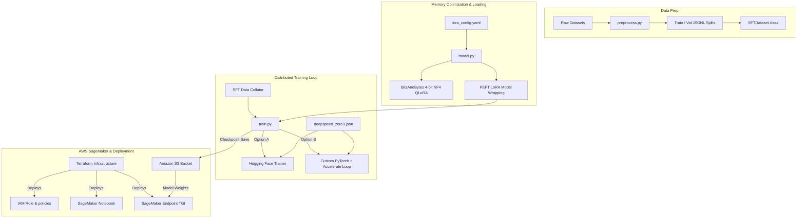

# Enterprise LLM Fine-Tuning Pipeline

[](https://opensource.org/licenses/MIT)
[](https://www.python.org/)
[](https://pytorch.org/)
[](https://www.terraform.io/)

An enterprise-grade, high-throughput fine-tuning pipeline designed for Supervised Fine-Tuning (SFT) of open-source causal language models (such as Llama 3, Mistral, and Qwen). This repository implements state-of-the-art memory optimization techniques to scale training from single-GPU workstations to multi-node distributed clusters on AWS SageMaker.

Developed and maintained by **Acadify Solution**.

---

## 🏗️ Architecture Overview

The system architecture is structured to decouple dataset engineering, model management, distributed training configurations, and cloud deployment infrastructure.



---

## ✨ Core Features

1. **Parameter-Efficient Fine-Tuning (PEFT)**: Full support for **LoRA** and **QLoRA** configurations. The pipeline supports loading base models in 4-bit (NormalFloat4) and 8-bit quantization format, cutting memory requirements by up to 75% while keeping model performance intact.
2. **Label Masking for Supervised Fine-Tuning**: Contains a custom PyTorch dataset implementation that constructs conversation templates, formatting dialogue turns, and masking prompt/instruction tokens (setting them to `-100`). This ensures loss gradients are calculated exclusively on target assistant responses.
3. **Multi-GPU Scaling with DeepSpeed ZeRO-3**: Out-of-the-box configurations for DeepSpeed ZeRO Stage 3 (Zero Redundancy Optimizer). Features optimizer and parameter offloading to CPU memory, enabling training of 8B to 70B parameter models on consumer/mid-grade hardware.
4. **Custom Orchestration vs. High-Level Trainer**: Supports dual-execution pathways:
   - Hugging Face `Trainer` API for standardized config-driven training runs.
   - Custom PyTorch loop powered by Hugging Face `Accelerate` for custom step logging, manual evaluation, and debugging.
5. **SageMaker & Infrastructure as Code (IaC)**: Deploy and run training at scale. Includes **Terraform** templates to provision AWS S3 storage buckets, secure IAM execution roles, Jupyter Notebook instances, and Real-Time Inference endpoints running Hugging Face TGI (Text Generation Inference) containers.

---

## 📂 Directory Structure

```directory
.
├── LICENSE                     # MIT License file
├── README.md                   # Architectural & usage documentation
├── requirements.txt            # Python dependencies (PyTorch, Transformers, DeepSpeed)
├── configs/
│   ├── deepspeed_zero3.json    # DeepSpeed Stage 3 memory offloading config
│   └── lora_config.yaml        # LoRA rank, alpha, target modules, & quantization config
├── data/
│   ├── dataset.py              # Custom SFT dataset implementation with label masking
│   └── preprocess.py           # Preprocessing script to clean and split datasets to JSONL
├── src/
│   ├── model.py                # Quantization utilities & PEFT adapter setup
│   ├── train.py                # Main training entry point (HF Trainer & custom loop)
│   └── utils.py                # Reproducibility seeds, memory logging, & stat utilities
└── terraform/
    ├── main.tf                 # Terraform SageMaker resources, S3 buckets, and IAM roles
    ├── outputs.tf              # SageMaker endpoint outputs & configuration metadata
    └── variables.tf            # Terraform variables definition
```

---

## 🚀 Quick Start Guide

### 1. Installation

Create a virtual environment and install the required training libraries:

```bash
# Clone the repository
git clone https://github.com/acadify-solution/fine-tuning-pipeline.git
cd fine-tuning-pipeline

# Create environment and install dependencies
python3 -m venv venv
source venv/bin/activate
pip install -r requirements.txt
```

### 2. Dataset Preparation

Use the preprocessing script to download, format, and partition a target dataset (defaults to `timdettmers/openassistant-guanaco` formatting):

```bash
python data/preprocess.py \
    --dataset_name "timdettmers/openassistant-guanaco" \
    --output_dir "data/processed" \
    --test_split_size 0.1
```

This generates `data/processed/train.jsonl` and `data/processed/val.jsonl` files mapped to standard conversation lists:
```json
{"messages": [{"role": "user", "content": "How do I implement a custom PyTorch dataset?"}, {"role": "assistant", "content": "You can subclass torch.utils.data.Dataset..."}]}
```

### 3. Training Options

#### Option A: Hugging Face Trainer (Default)
Run standard training with the Hugging Face `Trainer` orchestrator using local GPU systems:

```bash
python src/train.py \
    --model_id "meta-llama/Meta-Llama-3-8B-Instruct" \
    --train_path "data/processed/train.jsonl" \
    --val_path "data/processed/val.jsonl" \
    --lora_config "configs/lora_config.yaml" \
    --output_dir "checkpoints/sft_model" \
    --num_epochs 3 \
    --learning_rate 2e-4
```

#### Option B: Custom PyTorch Loop + Accelerate
For debugging and custom metrics monitoring (such as step-by-step GPU memory logging), execute the custom training loop:

```bash
python src/train.py \
    --model_id "meta-llama/Meta-Llama-3-8B-Instruct" \
    --train_path "data/processed/train.jsonl" \
    --val_path "data/processed/val.jsonl" \
    --lora_config "configs/lora_config.yaml" \
    --output_dir "checkpoints/sft_model_custom" \
    --run_custom_loop \
    --num_epochs 3
```

#### Option C: Distributed Training with DeepSpeed ZeRO-3
Configure Hugging Face Accelerate to run across multiple local GPUs with DeepSpeed:

```bash
# Configure environment parameters
accelerate config

# Launch distributed training run
accelerate launch src/train.py \
    --model_id "meta-llama/Meta-Llama-3-8B-Instruct" \
    --train_path "data/processed/train.jsonl" \
    --val_path "data/processed/val.jsonl" \
    --deepspeed_config "configs/deepspeed_zero3.json" \
    --output_dir "checkpoints/deepspeed_output"
```

#### Option D: Merging LoRA Weights
After fine-tuning is completed, merge the LoRA adapters back into the unquantized base model weights to generate a standalone model ready for deployment with high-throughput engines like vLLM or Hugging Face TGI:

```bash
python src/merge_peft.py \
    --base_model_name "meta-llama/Meta-Llama-3-8B-Instruct" \
    --adapter_dir "checkpoints/sft_model" \
    --output_dir "checkpoints/merged_model"
```

---

## ☁️ Deploying AWS SageMaker Infrastructure

Provision your cloud machine learning environment using Terraform.

### 1. Initialize and Validate Terraform Configs

Ensure you have your AWS CLI credentials configured (`aws configure`), then run:

```bash
cd terraform

# Initialize providers
terraform init

# Validate configuration syntax
terraform validate

# Plan provisioning deployment
terraform plan
```

### 2. Apply and Provision Infrastructure

Create the S3 bucket, IAM execution role, SageMaker Notebook, and real-time inference endpoint configuration:

```bash
terraform apply -auto-approve
```

### 3. Deploying Model to Endpoint

Once your model has trained and the adapter model is stored in S3 at `s3://<bucket-name>/checkpoints/sft_model/model.tar.gz`, SageMaker will automatically spin up a Text Generation Inference (TGI) container at the deployed endpoint using the resources configured in `main.tf`.

To clean up resources and prevent unwanted charges:
```bash
terraform destroy -auto-approve
```

---

## 📄 License

This project is licensed under the MIT License - see the [LICENSE](LICENSE) file for details.
